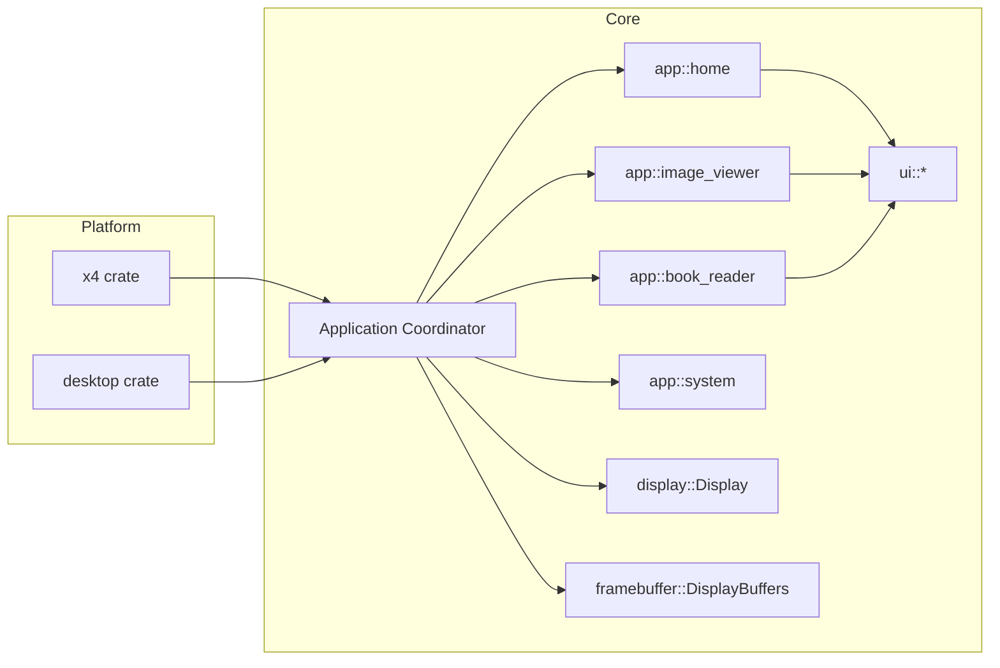
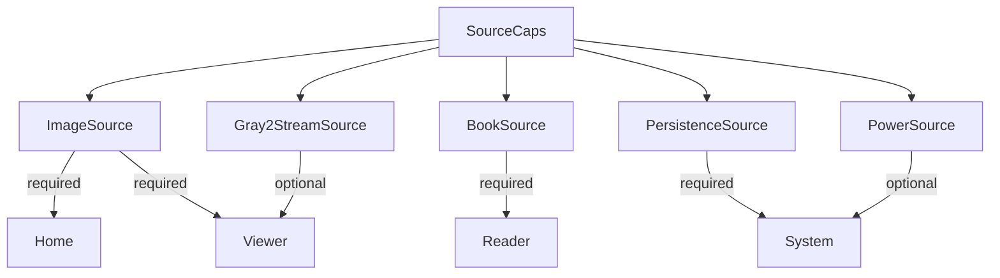
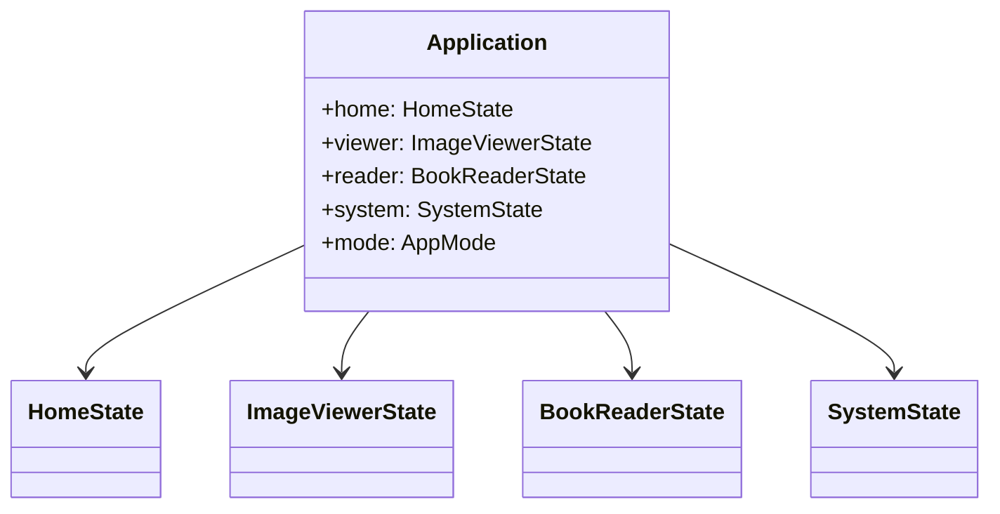

# Refactor Notes: Application Split

Date: 2026-02-06

This document captures the proposed refactored design for splitting `tern_core::application::Application`
into focused modules. It is intentionally high-level, and will be updated as the refactor proceeds.

## Goals
- Reduce complexity and flag-driven state in `Application` by isolating distinct modes.
- Define clearer boundaries between home/file browsing, image viewing, and book reading.
- Centralize system concerns like sleep/wake, resume, and persistence.
- Make platform integrations (`x4`, `desktop`) simpler by using capability-based `ImageSource` traits.

## Proposed Module Overview
- `core::app::home`
  - Start menu, recents, file browsing, thumbnail caching.
- `core::app::image_viewer`
  - Single image view, grayscale modes, page turn indicator, image scaling.
- `core::app::book_reader`
  - TRBK open/close, page ops, TOC, page cache.
- `core::app::system`
  - Sleep/wake, sleep wallpaper, resume, persistence glue.
- `core::app::coordinator` (or `Application`)
  - Owns state for all modules and delegates updates/draws.

## High-Level Relationships

## Capability-Based Image Source Traits

## State Ownership Sketch

## Field-to-Module Mapping (Current `Application` Fields)
Proposed ownership for fields currently in `core/src/application.rs`.

| Field | Proposed Owner | Notes |
| --- | --- | --- |
| `dirty` | Coordinator | Render scheduling and overall redraw invalidation. |
| `display_buffers` | Coordinator | Shared display backing buffers. |
| `source` | Coordinator | Will become a `SourceCaps` bundle passed to modules. |
| `entries` | Home | Directory listing. |
| `selected` | Home | Selected entry index in file list. |
| `state` | Coordinator | High-level mode enum (`AppMode`). |
| `current_image` | Image Viewer | Loaded image data for single-image view. |
| `current_book` | Book Reader | TRBK book info. |
| `current_page_ops` | Book Reader | Current page operations. |
| `next_page_ops` | Book Reader | Prefetch or next page operations. |
| `prefetched_page` | Book Reader | Prefetched page index. |
| `prefetched_gray2_used` | Book Reader | Tracks gray2 usage for prefetched page. |
| `toc_selected` | Book Reader | TOC selection index. |
| `toc_labels` | Book Reader | TOC display labels. |
| `current_page` | Book Reader | Current page index. |
| `book_turns_since_full` | Book Reader | Full refresh cadence. |
| `current_entry` | Coordinator | Active entry name for viewer/reader. |
| `last_viewed_entry` | System | Resume and persistence. |
| `page_turn_indicator` | Image Viewer | Page turn hint overlay. |
| `last_rendered_page` | Book Reader | Track last rendered page for redraw decisions. |
| `error_message` | System | Error overlay state. |
| `sleep_transition` | System | Sleep state machine. |
| `wake_transition` | System | Sleep state machine. |
| `full_refresh` | System | Global refresh policy hook. |
| `sleep_after_error` | System | Post-error flow. |
| `idle_ms` | System | Idle tracking. |
| `idle_timeout_ms` | System | Idle threshold. |
| `sleep_overlay` | System | Sleep UI overlay. |
| `sleep_overlay_pending` | System | Sleep UI state. |
| `wake_restore_only` | System | Wake behavior flag. |
| `resume_name` | System | Resume entry name. |
| `book_positions` | System | Persistence cache for reader. |
| `recent_entries` | Home | Recent list (persisted via system). |
| `path` | Home | Current file browser path. |
| `gray2_lsb` | Image Viewer / Book Reader | Shared gray2 buffers for streaming. |
| `gray2_msb` | Image Viewer / Book Reader | Shared gray2 buffers for streaming. |
| `start_menu_section` | Home | Start menu section state. |
| `start_menu_index` | Home | Start menu selection index. |
| `start_menu_prev_section` | Home | Start menu navigation history. |
| `start_menu_prev_index` | Home | Start menu navigation history. |
| `start_menu_cache` | Home | Recent preview cache. |
| `start_menu_nav_pending` | Home | Start menu animation/transition. |
| `start_menu_need_base_refresh` | Home | Start menu refresh behavior. |
| `sleep_from_home` | System | Sleep behavior depends on origin. |
| `sleep_wallpaper_gray2` | System | Sleep wallpaper mode. |
| `sleep_wallpaper_trbk_open` | System | Sleep wallpaper mode. |
| `recent_dirty` | System | Persistence dirty flag for recents. |
| `book_positions_dirty` | System | Persistence dirty flag for book positions. |
| `last_saved_resume` | System | Resume persistence state. |
| `exit_from` | Coordinator | Exit transition source. |
| `exit_overlay_drawn` | System | Exit UI overlay state. |
| `battery_percent` | System | Battery state. |

## Open Questions
- Should `SystemState` own persistence (recents/book positions) or should those live with modules and only be flushed by system?
- Should `Application` remain in `core::application` or move to `core::app::coordinator`?
- Which optional capabilities should be hard requirements for the firmware build vs the desktop build?
